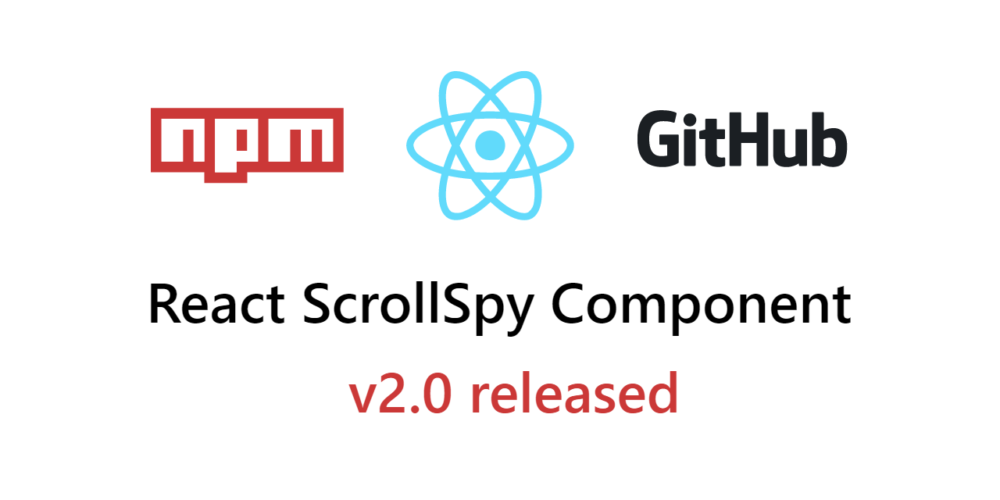

[](https://github.com/toviszsolt/react-scrollspy/blob/main/LICENSE)
[](https://www.npmjs.com/package/react-scrollspy-navigation)
[](https://github.com/toviszsolt/react-scrollspy/stargazers)
[](https://github.com/toviszsolt/react-scrollspy/actions/workflows/main.yml)
[](https://www.npmjs.com/package/react-scrollspy-navigation)
[](https://github.com/sponsors/toviszsolt)

## 

# React Scrollspy Component

**react-scrollspy-navigation** is a React Component, that automatically update navigation components based on scroll
position to indicate which link is currently active in the viewport. It also scrolls (navigation) to viewport when click
on a navigation component.

**[Demo with example code](https://mvzn2.csb.app/)**

**[Sponsor me on Github](https://github.com/sponsors/toviszsolt)**

**[Sponsor me on PayPal](https://paypal.me/toviszsolt)**

## How to install

Install via NPM or Yarn package manager

```
npm i react-scrollspy-navigation
```

```
yarn add react-scrollspy-navigation
```

## How to use it

Add a unique `id` to content blocks or heading tags for the elements you want to spy on. There is nothing more to do
with the content elements. It's awfully simple so far, right?

```jsx
// Content blocks
conat ContentWithBoxes = () => {
  return (
    <>
      <section id="target-1">Content here</section>
      <section id="target-2">Content here</section>
      <section id="target-3">Content here</section>
    </>
)};

// Heading tags
conat ContentWithHeaders = () => {
  return (
    <>
      <section>
        <h2 id="target-1">Target 1</h2>
      </section>
      <section>
        <h2 id="target-2">Target 2</h2>
      </section>
      <section>
        <h2 id="target-3">Target 3</h2>
      </section>
    </>
)};
```

Wrap your navigation structure with `ScrollSpy` component. Use only `a` tags whose `href` attribute is the hash link of
the `id` of an existing content element. You can use structures of any complexity or depth in the `ScrollSpy` component,
and you can nest multiple `ScrollSpy` components (although this works, it is not recommended). Don't worry, `ScrollSpy`
won't add any additional structures to the child component.

> #### Note:
>
> If you are new to url hashes, here is some information: https://en.wikipedia.org/wiki/URI_fragment

```jsx
import ScrollSpy from 'react-scrollspy-navigation';
```

```jsx
// Last item won't use as ScrollSpy item, but you can place there.
// Obviously, non hash links will not be processed.
const Navigation = () => {
  return (
    <ScrollSpy activeClass="nav-active">
      <nav>
        <ul>
          <li>
            <a href="#target-1">...</a>
          </li>
          <li>
            <a href="#target-2">...</a>
          </li>
          <li>
            <a href="#target-3">...</a>
          </li>
        </ul>
      </nav>
    </ScrollSpy>
  );
};
```

Don't forget to specify in the `activeClass` prop what className to add to the currently active link. Congratulations,
we are done, it was that simple. Continue reading the documentation to find out what options are available to configure
how `ScrollSpy` works.

> #### Note:
>
> The much loved `Refs` used in the previous version and React were thrown away.

## Configuration

### Available `ScrollSpy` component properties

| Prop        | Type                                       | Default                   | Description                                                                                                                                                                                                                |
| ----------- | ------------------------------------------ | ------------------------- | -------------------------------------------------------------------------------------------------------------------------------------------------------------------------------------------------------------------------- |
| activeClass | `string`                                   | empty sting               | Class name to be applied to the active link                                                                                                                                                                                |
| activeAttr  | `boolean`                                  | `false`                   | If true, the active link will have an attribute `data-active` attached to it.                                                                                                                                              |
| offsetTop   | `number`                                   | `false`                   | Offset from top the final scroll position in pixels. link                                                                                                                                                                  |
| offsetLeft  | `number`                                   | `false`                   | Offset from left the final scroll position in pixels. link                                                                                                                                                                 |
| behavior    | `'smooth' \| 'instant' \| 'auto' \| false` | `smooth`                  | Behavior of the scroll animation. See: [Element: scrollTo()](https://developer.mozilla.org/en-US/docs/Web/API/Element/scrollTo#options)                                                                                    |
| root        | `HTMLElement \| null \| false`             | `null`                    | Root element to be observed. See: [IntersectionObserver: IntersectionObserver()](https://developer.mozilla.org/en-US/docs/Web/API/IntersectionObserver/IntersectionObserver#options)                                       |
| rootMargin  | `string`                                   | `null`                    | Root margin for the intersection observer See: [IntersectionObserver: IntersectionObserver()](https://developer.mozilla.org/en-US/docs/Web/API/IntersectionObserver/IntersectionObserver#options) observed.                |
| threshold   | `number \| number[] \| false`              | `[0, 0.25, 0.5, 0.75, 1]` | Thresholds for the intersection. Element to be observed. See: [IntersectionObserver: IntersectionObserver()](https://developer.mozilla.org/en-US/docs/Web/API/IntersectionObserver/IntersectionObserver#options) observer. |
| onClickEach | `function`                                 | `false`                   | Callback fired when an element is clicked.                                                                                                                                                                                 |

### Parameters for using the `onClickEach(event, handler, container)` function.

- `event`: The original Click Event.
- `handler`: The internal click handler function. This should be called at the end of the `onClickEach` function, as you
  want the internal click handler to run.
- `container`: The target html element. Always try to find the scrollable parent of the linked element.

Example:

```jsx
const Comp = () => {
  const onClickEach = (e, handler, container) => {
    console.log('The clicked element:', e.target);
    console.log('The container element of target:', container);
    // You can do something here if you want.
    handler();
  };

  return <ScrollSpy onClickEach={onClickEach}>...</ScrollSpy>;
};
```

## Compatibility

A component depends on the following functions or classes, which define its compatibility.

- Scroll methods on elements (scroll, scrollTo, scrollBy):
  [supported browsers](https://caniuse.com/element-scroll-methods)
- IntersectionObserver API: [supported browsers](https://caniuse.com/mdn-api_intersectionobserver)

## Example code

Check out the interactive demo and example codes.

**[Demo with example code](https://mvzn2.csb.app/)**

**[Sponsor me on Github](https://github.com/sponsors/toviszsolt)**

**[Sponsor me on PayPal](https://paypal.me/toviszsolt)**

## Guidelines

To learn about the guidelines, please read the [Code of Conduct](./CODE_OF_CONDUCT.md),
[Contributing](./CONTRIBUTING.md) and [Security Policy](./SECURITY.md) documents.

## License

MIT License @ 2021 [Zsolt Tövis](https://github.com/toviszsolt)

If you found this project interesting, please consider supporting my open source work by
[sponsoring me on GitHub](https://github.com/sponsors/toviszsolt) /
[sponsoring me on PayPal](https://www.paypal.com/paypalme/toviszsolt) /
[give the repo a star](https://github.com/toviszsolt/react-scrollspy).
